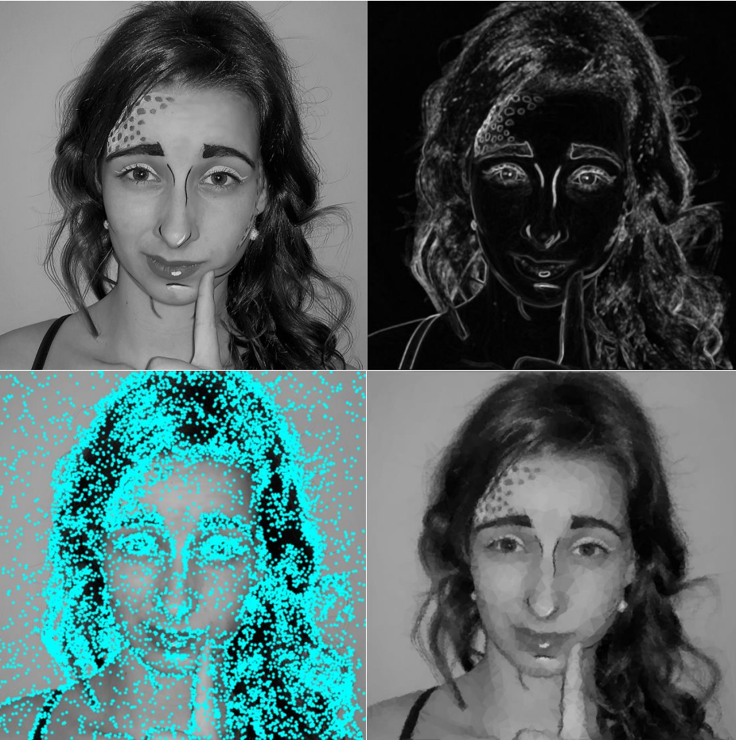

# Decomposition of image to Delaunay triangulation

## Abstract

The program generates an image composed of triangles from a given input image. The algorithm first selects pixels based on a specified criterion. It then performs triangulation using these vertices, and for each triangle, it selects the average color in that area, using it as the color for the entire triangle. The input is any image, and the output is the same image triangulated into triangles and a video with an animation of the gradual rendering of triangles.

## Algorithm

For a chosen fixed size of a square neighborhood, the average color value in the neighborhood is calculated for each pixel. Subsequently, the sum of the squared differences between the average value and pixel values in the neighborhood is computed, referred to as differences. The result is scaled to form a probability distribution, ensuring the total sum of these differences is one.

Another option for creating a distribution is selecting points using the Sobel operator, a convolution with a mask corresponding to the derivative in one direction, or a suitable function derived from the convolution results with the Sobel operator in both x and y directions. The results for each pixel are then scaled to form a probability distribution.

Using this probability distribution, a specified number of points are selected, which can be determined based on a variable depending on the image size. In addition to these points, four corner points of the image are also included to ensure that the resulting triangulation covers the entire image (as the triangulation covers the convex hull of the selected points).

The selected points undergo Delaunay triangulation, maximizing the minimum angle. Simultaneously, this triangulation has the property that the circumcircle of each triangle in the triangulation does not contain any interior points from the specified points. The chosen corner points ensure that the resulting triangulation covers the entire image. Finally, the average color for each triangle is computed.

The algorithm's output is a triangulated image using Delaunay triangulation with points selected using the above algorithm, containing the average color from the pixels within each triangle.

## Program

The program is written in the Python language. It utilizes the numpy library for mathematical computations, opencv for image manipulation, the scipy library for Delaunay triangulation, and tqdm for visualizing the computation speed.

### Parameters:

• SIZE_X, SIZE_Y: part of image where we want to compute, default=-1 (whole image)
• path: path to specific image
• method (= Similarity / Sobel): which method is used for computation (default=’similarity’)
• PART: density of chosen pixels, 1 pixel/PART pixels, default=80
• STEP: how many triangles next step in animation
• KERNEL_SIZE: size of kernel for algorithm (neighborhood), default=5
